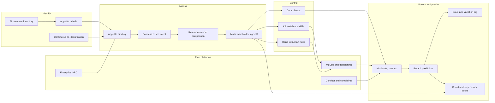

# Appetitebind

**Source:** `ai-in-cyber/deloitte-gx-ai-and-risk-management/`
**Domain:** `ai-cyber`
**One-liner:** An enterprise AI risk operating system that binds every AI use case to risk-appetite criteria and a fairness policy, runs continuous control testing with a governed kill-switch, and predicts when residual risk will breach thresholds before the board pack is written.
**Wedge:** Risk, compliance, and model-governance teams at mid-to-large financial services firms — banks and insurers first — that are past "AI for the sake of AI" experiments and need to put customer-facing or capital-relevant AI through an existing Risk Management Framework without inventing a parallel bureaucracy. The entry beachhead is AI use cases that reprice, recommend, or decide for customers (the paper's insurance policy-pricing running example), where conduct, fairness, and explainability already have regulatory heat.
**Positioning:** AI applied inside enterprise risk management — not a cyber SOC tool, not a model-validation factory. Assayline industrialises bank model validation throughput; Alertworth prices cyber detection queues. Appetitebind is the RMF lifecycle for AI itself: identify–assess–control–monitor at the shorter intervals continuous learning demands, with appetite and fairness as first-class gates, modular decision-driver visibility, hand-to-human exits, and supervisory-ready audit trails. Effective risk management, as the source argues, is pivotal to successful AI adoption rather than an inhibitor of it.

## Market research synthesis

### Thesis from source

The paper's premise is that AI is not new, but financial services firms are only recently confronting its full potential — and its full risk. AI can drive operational and cost efficiencies and strategic transformation, including better customer engagement, yet barriers remain real: limited availability of the right quality and quantity of data, insufficient understanding of ai-inherent risks, culture, and regulation. EU and international regulators recognise benefits for markets, consumers, and supervisory work, while remaining mindful of risks and unintended consequences. That caution is amplified by years of penalties for customer mistreatment and market misconduct; fair treatment and market integrity, plus the relatively untried nature of AI in a regulatory context, have made firms understandably cautious.

The central claim that defines the product is precise: the biggest challenge is less about completely new risk types and more about existing risks being harder to identify in an effective and timely manner, or manifesting in unfamiliar ways. Continuously learning systems that decide via complex statistics rather than predefined rules make decision drivers hard to understand; auditability and traceability become challenging; and the speed of evolution means errors can manifest at large scale in a short time. Firms must therefore review and adapt the existing Risk Management Framework across identify–assess–control–monitor, run those activities at shorter and more frequent intervals, revisit risk appetite statements, and develop new components such as a fairness policy to inform the RMF. Effective risk management is framed as pivotal to successful AI adoption, not as a brake on innovation.

Adoption data underlines the timing. A Deloitte/EFMA survey of more than 3,000 C-suite executives found AI impact expectations varying sharply by sector — banking prioritising customer service (65%) and back office (52%), insurance prioritising back office (78%) and risk management (56%) — while overall adoption remained early: 40% still learning how to deploy AI, 11% not started, only 32% actively developing solutions. Barriers include data quality and legacy silos; transparency, accountability, and compliance (including GDPR rights around automated decisions with significant effects); board and control-function understanding; and human-capital impacts from automation and scarce AI talent. The paper insists firms do not need entirely new processes for AI, but must enhance existing ones and address resources, roles, and responsibilities — including a scientific, sandbox mind-set with all three lines of defence participating from the start.

The Deloitte AI Risk Management Framework surfaces more than sixty ai-related risks; the commercially actionable subset for a product includes algorithm bias, inaccuracy, feedback loops, and misuse; cyber/open-source dependency and malicious manipulation of opaque models; conduct and change-management effects; data protection and regulatory justification of decisions; culture and skills; and supplier/black-box liability and market concentration. Risk appetite may not change in aggregate when AI arrives, but the relative balance of components will, and the tools to manage them definitely will. Firms should apply consistent assessment criteria to every use case — for example whether a solution is external-facing — to focus effort at case and portfolio level.

The insurance policy-pricing example is the workflow design brief. An AI property-pricing model using unstructured data may price a one-off local event as a permanent location risk, or later reuse assessment data to profile individuals without consent — manifesting data protection, consent, mispricing, and ethics risks in unfamiliar combinations. Assessment must compare AI outputs to non-AI models with static identifiable drivers, challenge modular pipelines where one model feeds another, and cover technical, business, and operational parameters. Controls must be dynamic far beyond initial training: out-of-sample testing, stress scenarios, customer-journey testing, a governed hand-to-human when confidence falls outside tolerance, and optionally modular algorithms that keep decision drivers inspectable. Monitoring must cover technical performance, business outcomes (premiums, loss ratios, portfolio mix, drop-off of customer groups), operational metrics (volume pushed to human underwriters, speed to issue), incoming data-distribution shift, complaints alleging discrimination, and regulatory change that forces redesign. Supervisors, drawing on algorithmic-trading and SM&CR analogues, will expect board-approved RMF coverage of each application, clear owners, trained governance committees, kill-switches with BCP, periodic re-validation scaled to learning rate and risk, control-function expertise and authority to challenge, full inventories, documented testing and issue tracking, and auditable change control when algorithms vary.

### Buyer & economic model

- **Primary buyer:** Chief Risk Officer or Head of Enterprise Risk Management, with Compliance and the accountable senior manager under SM&CR-style regimes as co-sponsors. For insurers, the Chief Underwriting Officer is a critical user sponsor on pricing use cases; for banks, the head of conduct risk or model risk may be the day-to-day champion — without collapsing this product into a validation factory.
- **Users:** AI use-case owners in the business, risk and compliance partners embedded in agile delivery, fairness/conduct specialists, data and model stewards, internal audit, governance committee secretaries, and regulatory relations.
- **Budget owner / value metric:** the risk and compliance operating budget plus avoided cost of delayed AI launches, conduct remediation, and supervisory intervention. Value metrics: time from use-case proposal to appetite-aligned go-live decision; share of production AI use cases with current appetite binding, fairness assessment, and kill-switch drill date; predicted vs realised appetite breaches; residual AI risk within stated limits; supervisory findings closed without capital or conduct add-ons.
- **Competing status quo:** a generic GRC workflow that treats an AI model like a waterfall IT change; a model inventory that does not know continuous learning; fairness discussed in principles decks without measurable thresholds; kill-switches that exist only in architecture diagrams; board packs that list AI initiatives without residual-risk trajectories. Cyber SOC tools and pure MRM validation platforms do not bind use cases to enterprise appetite or predict conduct-risk breaches from portfolio mix drift.

### Domain constraints

- **Regulatory / trust / safety:** GDPR/UK GDPR automated-decision explainability and data-subject rights; fair treatment and conduct rules; SM&CR-style individual accountability; algorithmic-trading-derived supervisory expectations for governance, testing, and kill-switches; sectoral model and pricing rules for insurers and banks. Bias and fairness must be defined operationally by the firm before they can be tested — values are not optional metadata.
- **Data sensitivity:** training and monitoring data for customer-facing AI includes protected and vulnerable-customer attributes; sandbox and out-of-sample tests must respect purpose limitation; decision-driver explanations for customers must not leak other customers' data.
- **Change-management realities:** agile delivery will reject a monthly risk committee as the only gate; risk functions must participate continuously on high-risk cases without becoming a second product owner. Business owners fear that fairness constraints kill margins; the product must show portfolio-mix and complaint signals early rather than only at year-end. Three lines must share the sandbox or control design will be retrofitted theatre.

## Business requirements

- BR-1: Every AI use case must receive a recorded appetite-binding decision against standard assessment criteria (including external-facing status, customer impact, continuous-learning flag, and regulatory scope) before production traffic is enabled.
- BR-2: A firm-approved fairness policy with measurable thresholds must exist as a gated input to assess and monitor; no customer-facing AI use case may go live without a fairness assessment against that policy.
- BR-3: Risk identification must be continuous for learning systems: material change in use, data sources, or decision-driver distribution must trigger reassessment, not wait for an annual cycle.
- BR-4: Assessment must compare AI outcomes to agreed reference models or rules where they exist, and record rationale for material variance, across technical, business, and operational parameters.
- BR-5: Controls must include out-of-sample testing, stress/scenario tests, customer-journey tests at defined frequency, and a governed hand-to-human path when confidence or risk tolerances are breached.
- BR-6: A kill-switch (or exit chute) with business-continuity and remediation protocols must be registered, drill-tested on a defined cadence, and executable by an accountable role without vendor intervention.
- BR-7: Monitoring must cover technical performance, business outcomes, operational handoff volumes, data-distribution shift, discrimination-related complaints, and regulatory-change signals that require redesign.
- BR-8: The platform must predict approaching appetite or fairness threshold breaches from leading indicators (portfolio mix drift, hand-to-human spike, complaint rate, data shift) early enough for governance action before the board pack is finalised.
- BR-9: Each AI application must have a named accountable owner responsible for approval, review triggers, and updates when market or regulatory factors affect accuracy, fairness, or compliance.
- BR-10: Inventories, testing evidence, issue tracking, and algorithm variations must be exportable to an auditable standard suitable for supervisors and internal audit.
- BR-11: Third-party and black-box components must carry documented liability allocation, support status, and concentration flags; unsupported open-source dependencies cannot be silent.
- BR-12: Three-lines participation — business, risk/compliance, internal audit — must be evidenced at sandbox, go-live, and periodic re-validation stages for high-risk use cases.

## User stories

Canonical user stories live in sibling [USER_STORIES.md](USER_STORIES.md).

## System design

### Overview

Appetitebind runs the identify–assess–control–monitor lifecycle for AI use cases as a continuous operating system.

Identify registers each use case, classifies it with standard criteria, and keeps organisational-level AI risks (culture, skills, concentration) alongside case-level risks. Assess produces an appetite-binding decision, a fairness assessment against firm policy, and a residual-risk rating with required controls. Control registers tests (out-of-sample, stress, journey), modular driver inspection where applicable, hand-to-human rules, and kill-switch configuration with drill schedule. Monitor ingests technical, business, operational, complaint, and data-shift metrics; a prediction service forecasts threshold breaches; governance tasks and board snapshots are emitted early enough to act. Re-validation frequency scales with learning rate and customer impact. The inventory and evidence store remain supervisory-ready at all times.

### Actors & boundaries

- **Actors:** CRO/ERM, compliance, conduct/fairness, use-case owners, data/model stewards, internal audit, governance committees, regulators (consumers of packs), third-party AI vendors (bounded evidence providers).
- **Trust boundary:** model code and raw training data remain in the firm's model/data platforms; Appetitebind stores risk objects, assessments, control evidence references, monitoring metrics, predictions, and decisions. Customer-level data used in fairness tests is processed under purpose limitation with aggregated outputs for boards.
- **Human-in-the-loop points:** appetite-binding approval; fairness policy threshold setting; go-live gate; hand-to-human decisions; kill-switch execution; edge-case review; committee acceptance of predicted breach responses; audit challenge.

### Core capabilities

1. **AI use-case inventory and ownership** — register, owner, lifecycle state, continuous-learning flag.
2. **Appetite criteria and binding** — standard questions, binding decisions, portfolio view of appetite consumption.
3. **Fairness policy and assessment** — firm policy, measurable thresholds, case-level assessments.
4. **Continuous risk identification** — triggers on use expansion, data change, driver drift.
5. **Assessment workspace** — reference-model comparison, multi-stakeholder sign-off, agile-compatible checkpoints.
6. **Control library and testing** — out-of-sample, stress, journey tests; evidence capture.
7. **Hand-to-human and kill-switch governance** — rules, drills, BCP links, execution logs.
8. **Monitoring metric hub** — technical, business, operational, complaint, and data-shift feeds.
9. **Breach prediction** — leading-indicator forecasts of appetite/fairness/threshold breaches.
10. **Issue and variation tracking** — auditable defects and algorithm change control.
11. **Three-lines evidence** — sandbox and gate participation records.
12. **Supervisory and board reporting** — inventory packs, residual-risk trajectories, early-warning briefs.

### Conceptual data

- **Primary entities:** AiUseCase, UseCaseOwner, AppetiteCriteria, AppetiteBinding, FairnessPolicy, FairnessAssessment, RiskIdentification, RiskAssessment, ReferenceComparison, ControlRequirement, ControlTest, TestEvidence, HandToHumanRule, KillSwitch, KillSwitchDrill, MonitoringMetric, DataShiftSignal, ComplaintSignal, BreachPrediction, Issue, AlgorithmVariation, ThreeLinesSignOff, BoardSnapshot, SupervisoryExport.
- **Critical events:** use case registered; appetite bound or refused; fairness assessed; risk re-identified on change; assessment signed off; control test passed/failed; hand-to-human invoked; kill-switch drilled or executed; metric threshold approached; breach predicted; issue opened; algorithm variation recorded; board snapshot published.
- **Retention / audit needs:** bindings, assessments, test evidence, variations, and kill-switch events retained for the supervisory and conduct-investigation window; monitoring metrics retained long enough to reconstruct breach predictions; fairness test microdata minimised and purged per policy after aggregate evidence is sealed.

### Integrations (conceptual)

- **Systems of record:** model/feature stores and MLOps platforms, policy admin and pricing engines (insurance), credit/decisioning engines (banking), enterprise GRC, conduct/complaint systems, data catalogue, HR learning systems for committee training records.
- **Upstream signals:** production performance metrics, portfolio and loss-ratio feeds, complaint taxonomies, data-quality and drift monitors, regulatory-change feeds, vendor SBOM/support status.
- **Downstream actions:** go-live blocks in MLOps, routing to human underwriters/advisors, kill-switch execution hooks, committee agenda items, remediation workflows, supervisory pack publication.

### High-level architecture

### Success metrics

- **Leading:** share of production AI use cases with current appetite binding and fairness assessment; median days from proposal to binding decision; kill-switch drills completed on schedule; monitoring coverage across technical/business/operational/complaint/data-shift; predicted breaches actioned before threshold cross; three-lines sign-off completeness on high-risk cases.
- **Lagging:** appetite or fairness breaches in production; conduct complaints tied to automated decisions; supervisory findings on AI governance; time-to-halt on kill-switch execution in drills and live events; AI initiatives launched then rolled back for uncontrolled risk; residual AI risk within stated enterprise appetite.

## OpenAPI skeleton

Canonical HTTP surface lives in sibling [openapi.yaml](openapi.yaml). Summary:

- **Base path:** `/v1/...`
- **Auth:** `X-API-Key` for MLOps, GRC, and metric connectors; Bearer JWT for risk, compliance, owners, and auditors.
- **Resource groups:** UseCases, Appetite, Fairness, Assessments, Controls, Monitoring, Predictions, Governance.
