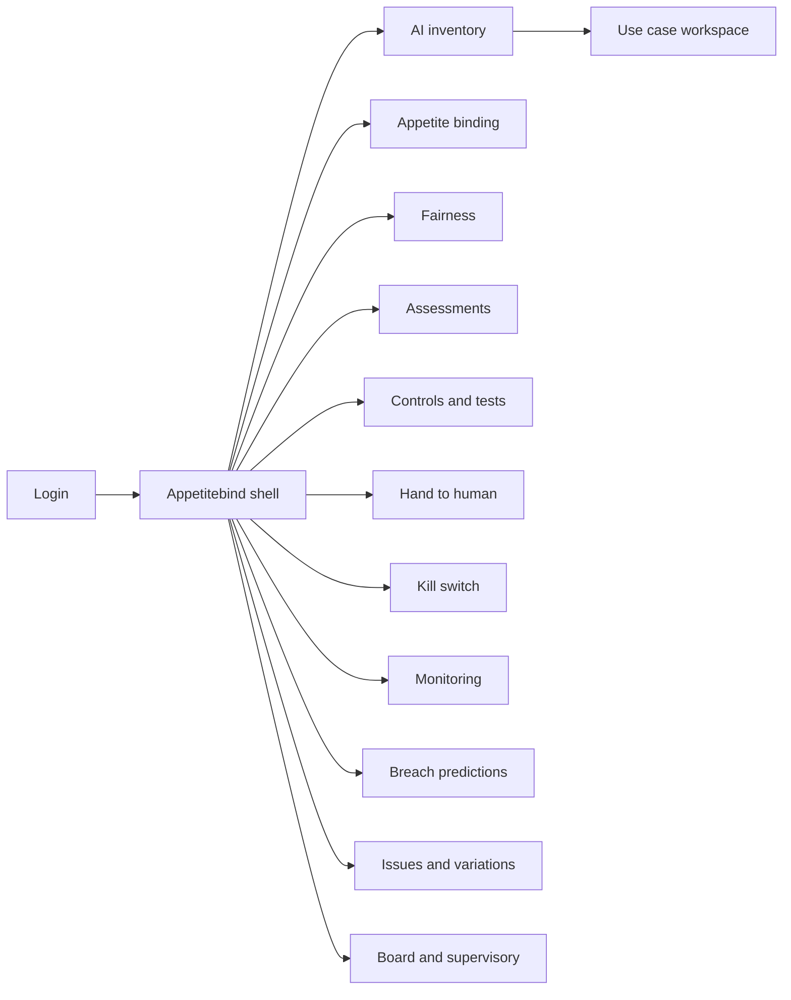
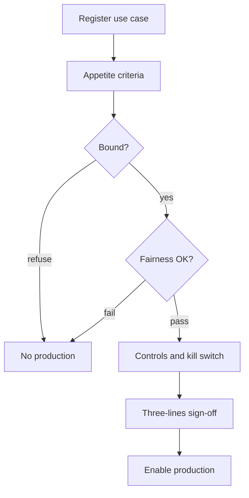

# Appetitebind — Web app

**Product:** [PRODUCT.md](./PRODUCT.md)
**Primary surface:** Enterprise AI risk operating system (use-case inventory → appetite/fairness gates → monitor & breach prediction)
**Secondary surfaces:** Kill-switch drill console; supervisory evidence export viewer
**Design thesis:** Appetitebind is a binding desk for AI inside the RMF — the UI metaphor is a limit book where every use case occupies appetite and fairness headroom, and predicted breaches flash before the board pack locks. Visual language is deep navy with binding-teal for within-limit cases and signal-copper for approaching thresholds; continuous-learning cases carry a living pulse, static rules stay still. Brand wordmark seals inventory and committee packs so supervisors know residual AI risk was bound here, not narrated in a principles deck.

## UX research synthesis

### Category peers (best-in-class)

- **Credo AI Governance:** Use-case registries with policy packs, evidence, and go/no-go gates for AI. Steal: criteria-driven registration before production; reject principles-only checklists without measurable thresholds.
- **Monitaur / ModelOp Center:** Continuous monitoring and inventory for regulated model estates. Steal: production monitoring hubs with issue/variation trails; reject treating AI like a one-time IT change request.
- **Fiddler / Arthur AI:** Explainability and drift monitoring with slice performance. Steal: driver-level comparison panes and data-shift signals; reject black-box “trust scores” as the only control.
- **IBM OpenPages / OpenScale (GRC + AI):** Enterprise risk appetite and model monitoring in financial services. Steal: appetite consumption views and three-lines workflows; reject annual-only reassessment for learning systems.

### Patterns to adopt / reject

- **Adopt:** Appetite-binding before production traffic; fairness policy as a hard gate; continuous re-ID triggers; reference-model variance rationale; hand-to-human + kill-switch drills; breach prediction before pack lock; three-lines sign-off evidence; supervisory export packs.
- **Reject:** Parallel AI bureaucracy outside RMF; fairness as PDF principles; kill-switch as architecture diagram only; board lists of “AI initiatives” without residual trajectories; purple AI ethics mascots; SOC-alert aesthetics.

### Trust, density, and workflow constraints from PRODUCT.md

No production without appetite binding (BR-1) and fairness assessment for customer-facing cases (BR-2). Learning systems reassess on material change (BR-3). Reference comparisons and multi-parameter assessment (BR-4). Dynamic controls including H2H (BR-5) and drilled kill-switch (BR-6). Monitoring spans technical/business/ops/complaints/shift (BR-7). Predictions must beat the board calendar (BR-8). Named owners (BR-9). Supervisory-ready exports (BR-10). Third-party/black-box flags (BR-11). Three-lines at sandbox/go-live/re-validation (BR-12).

## Information architecture

### Nav model

### Roles → default home

| Role | Default home | Why |
|------|--------------|-----|
| CRO / Head of ERM | Inventory + predicted breaches | Appetite defence (BR-1, BR-8) |
| AI use-case owner | Use case workspace / assessment | Criteria before build |
| Risk / compliance partner | Assessments checkpoints | Agile-compatible gates |
| Conduct / fairness specialist | Fairness monitoring | Segment drift & complaints (BR-2, BR-7) |
| Internal audit | Three-lines evidence + kill drills | Audit RMF, not data science |
| Regulatory relations | Supervisory export | Evidence-led engagement (BR-10) |
| Governance secretary | Board snapshots | Pack lock vs predictions |

### Cross-links to OpenAPI resources

| Nav area | OpenAPI tags / resources |
|----------|---------------------------|
| Inventory / owners | UseCases |
| Criteria / bindings | Appetite |
| Policy / assessments | Fairness |
| Reference compare / sign-off | Assessments |
| Tests / H2H / kill-switch | Controls |
| Metrics / complaints / shift | Monitoring |
| Threshold forecasts | Predictions |
| Issues / variations / three-lines / packs | Governance |

## Screen inventory

### AI inventory (home)

- **Purpose:** Single inventory of AI applications with owners, residual risk, binding status, kill-drill status.
- **Entry:** CRO default; supervisory prep.
- **Layout regions:** Portfolio table (external-facing, continuous-learning, residual, appetite headroom); predicted-breach rail; concentration/third-party flags; brand + last pack lock time.
- **Primary actions:** Open use case; register new; export inventory.
- **Empty / loading / error:** Empty = guided register first case; stale binding = production traffic blocked badge.
- **BR / story ties:** BR-1, BR-9, BR-11; CRO stories.

### Use case workspace

- **Purpose:** One place for lifecycle state, criteria answers, owners, and gate status.
- **Entry:** Inventory row.
- **Layout regions:** Criteria panel; binding/fairness/control status chips; continuous-learning pulse; third-party SBOM/support; three-lines timeline.
- **Primary actions:** Submit for binding; request reassessment; open monitoring.
- **Empty / loading / error:** Missing owner = cannot advance (BR-9).
- **BR / story ties:** BR-1, BR-9, BR-12.

### Appetite binding

- **Purpose:** Recorded bind/refuse against standard criteria before production traffic.
- **Entry:** From workspace; portfolio appetite view.
- **Layout regions:** Criteria checklist; appetite consumption at portfolio level; decision + rationale; production enablement lock.
- **Primary actions:** Bind; refuse; schedule revisit on trigger.
- **Empty / loading / error:** Attempted enable without bind = hard block with audit (BR-1).
- **BR / story ties:** BR-1; CRO and owner stories.

### Fairness policy and assessment

- **Purpose:** Firm policy with measurable thresholds; case assessment required for customer-facing go-live.
- **Entry:** Fairness nav; go-live gate.
- **Layout regions:** Policy thresholds; segment outcome tables; complaint linkage; out-of-sample vs live; assessment decision.
- **Primary actions:** Assess; fail gate; open edge-case review queue.
- **Empty / loading / error:** No firm policy = block all customer-facing go-lives (BR-2).
- **BR / story ties:** BR-2, BR-7; fairness specialist stories.

### Assessment workspace

- **Purpose:** Compare AI to reference models/rules; technical/business/operational parameters; multi-stakeholder sign-off.
- **Entry:** Assess nav; agile checkpoint.
- **Layout regions:** Reference variance with driver-level explanation; parameter tabs; sign-off from business/risk/audit as required; sandbox participation proof.
- **Primary actions:** Record variance rationale; sign off; trigger re-ID on material change.
- **Empty / loading / error:** No reference where required = documented exception path.
- **BR / story ties:** BR-3, BR-4, BR-12.

### Control tests

- **Purpose:** Out-of-sample, stress, journey tests on defined cadence with evidence capture.
- **Entry:** Controls nav.
- **Layout regions:** Test schedule; results; failed → issue; frequency scaled to learning rate.
- **Primary actions:** Run/record test; attach evidence; open issue.
- **Empty / loading / error:** Overdue test = go-live/monitor degrade banner.
- **BR / story ties:** BR-5.

### Hand-to-human rules

- **Purpose:** Governed exit when confidence/risk outside tolerance; operational volume visible.
- **Entry:** From controls; underwriter/ops view.
- **Layout regions:** Rule thresholds; live handoff volume; edge-case pair queue; disposition back to model governance.
- **Primary actions:** Tune rules; review edge cases; export ops metrics.
- **Empty / loading / error:** Spike prediction links to breach forecast (BR-8).
- **BR / story ties:** BR-5, BR-7; use-case owner stories.

### Kill-switch console

- **Purpose:** Registered exit chute with BCP, drill cadence, accountable executor — no vendor dependency.
- **Entry:** Kill nav; drill calendar; live incident.
- **Layout regions:** Switch config; BCP link; drill history; execution log; time-to-halt.
- **Primary actions:** Execute drill; execute live; verify MLOps hook.
- **Empty / loading / error:** Overdue drill = residual risk inflated / supervisory flag.
- **BR / story ties:** BR-6; audit stories.

### Monitoring hub

- **Purpose:** Technical, business, operational, complaint, data-shift metrics in one case view.
- **Entry:** Monitor nav; case workspace.
- **Layout regions:** Metric tiles; portfolio mix by segment; complaint taxonomy; data-shift charts; regulatory-change signals.
- **Primary actions:** Acknowledge alert; open prediction; raise issue.
- **Empty / loading / error:** Missing feed = coverage gap on monitoring completeness KPI.
- **BR / story ties:** BR-7.

### Breach prediction board

- **Purpose:** Forecast appetite/fairness threshold breaches before board pack finalises.
- **Entry:** CRO home rail; Predictions nav.
- **Layout regions:** Leading indicators (mix drift, H2H spike, complaints, shift); time-to-breach; recommended governance action; pack-lock countdown.
- **Primary actions:** Assign action; defer with reason; include in early-warning brief.
- **Empty / loading / error:** Empty = within limits with last forecast time.
- **BR / story ties:** BR-8; CRO stories.

### Issues and algorithm variations

- **Purpose:** Auditable defects and who-changed-what for continuous learning.
- **Entry:** Issues nav; from failed test.
- **Layout regions:** Issue queue; variation log; approver; link to binding impact.
- **Primary actions:** Open/close issue; record variation; require re-bind if material.
- **Empty / loading / error:** Unapproved variation in prod = kill-candidate banner.
- **BR / story ties:** BR-10; auditor stories.

### Board and supervisory packs

- **Purpose:** Residual-risk trajectories, inventory, evidence — not initiative lists.
- **Entry:** Packs nav; pack-lock workflow.
- **Layout regions:** Snapshot; predicted vs realised; three-lines completeness; export formats.
- **Primary actions:** Lock pack; export supervisory zip; verify hashes.
- **Empty / loading / error:** Open predicted breaches block “clean” pack language.
- **BR / story ties:** BR-8, BR-10, BR-12.

## Key flows

1. **Bind then go-live** — register → criteria → appetite bind → fairness assess → controls registered → three-lines sign-off → enable traffic; failure: any gate open blocks MLOps enable.

2. **Continuous re-ID** — data/use/driver change detected → reassessment task → re-bind if required (BR-3).

3. **Predicted breach** — leading indicators → forecast → governance action before pack lock (BR-8).

4. **Kill-switch drill** — schedule → execute → measure time-to-halt → log; overdue elevates residual (BR-6).

5. **Supervisory export** — select cases → inventory + bindings + tests + issues + variations → sealed pack (BR-10).

## Design system

### Tokens (CSS variables)

- `--color-ink: #E8EEF6` — primary text
- `--color-ground: #0A1220` — navy ground
- `--color-panel: #121C2E` — panels
- `--color-rule: #2A3A52` — dividers
- `--color-bind: #3FA6A0` — within appetite / bound teal
- `--color-bind-dim: #1F5C58` — headroom low
- `--color-predict: #C47A3A` — approaching breach copper
- `--color-breach: #D14B4B` — breached / kill
- `--color-learn: #7B8FD4` — continuous-learning pulse
- `--color-steel: #8F9BB0` — secondary labels
- `--color-brand: #A8C4C2` — Appetitebind wordmark
- `--font-display: "Source Sans 3", sans-serif` — titles and headroom numerals
- `--font-mono: "Source Code Pro", monospace` — case ids, variation hashes, export ids
- `--space-1`…`--space-8`: 4px scale
- `--radius-sm: 4px`; `--radius-md: 8px`
- `--motion-bind: 180ms ease-out` — binding confirm
- `--motion-predict: 300ms pulse` — approaching threshold
- `--motion-learn: 2.4s ease-in-out infinite` — subtle continuous-learning indicator (pausable)
- Atmosphere: faint limit-book ruled lines in panels; soft vignette; no purple ethics glow; no SOC red/green fireworks as default.

### Typography & brand

- Display for appetite headroom and time-to-breach; mono for use-case ids, variation hashes, pack seals.
- Brand on inventory, binding, and packs; never generic “Dashboard.”
- Login: brand-first; headline (“Bind AI to appetite before it decides”); one CTA.

### Do / don’t

- **Do:** Gate production on binding + fairness; show predicted breaches vs pack lock; drill kill-switches; version algorithm changes; evidence three-lines.
- **Don’t:** Principles-only fairness; annual-only review for learners; initiative vanity lists; editable historical bindings; emoji risk; card walls of static metrics.

### Accessibility & domain trust cues

- AA+ on bind/predict/breach; state in text (Bound / Approaching / Breached).
- Live regions for predicted breaches and kill execution.
- Focus order: inventory → bind → fairness → controls → monitor → pack.
- Fairness microdata never on board views — aggregates only.

## Component patterns

- **AppetiteHeadroomBar** — portfolio consumption vs limits.
- **BindingDecisionCard** — criteria answers + bind/refuse + production lock.
- **FairnessThresholdTable** — measurable policy vs observed segments.
- **ReferenceVariancePane** — AI vs reference drivers with rationale.
- **HandToHumanMeter** — volume pushed to humans vs tolerance.
- **KillSwitchDrillTile** — cadence, last drill, time-to-halt.
- **BreachForecastRow** — leading indicators + ETA + pack-lock marker.
- **AlgorithmVariationLog** — who/what/why change control.
- **ThreeLinesSignOffStrip** — sandbox / go-live / re-validation evidence.
- **SupervisoryExportPack** — sealed inventory and evidence bundle.

## Out of scope for v1 web

- Training/hosting models inside the product; cyber SOC triage (Alertworth); bank MRM validation factory throughput (Assayline); customer-facing explanation portals; mobile committee apps; generative “ethics chatbot” as a control.
